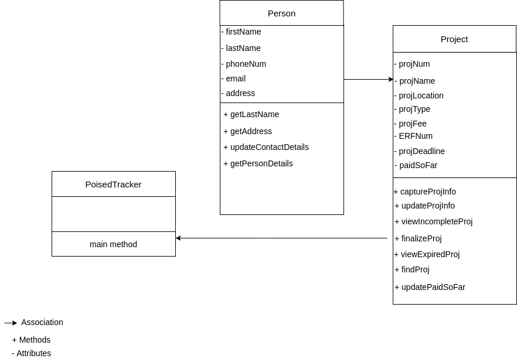

#### Projects
This repository contains a list of projects I have worked on or still working on. 

#### Disclaimer
All source code in this repository are written strictly to practice programming.The codes were not written with optimality in mind.

#### finance_calculator

This Python project is a simple financial calculator that functions as both a financial calculator and a home loan repayment calculator.
Users can choose the type of financial calculation they want to do. 

##### Dependencies

- Python 3 or later

##### Running finance_calculator

From the terminal type the following commands

    git clone https://github.com/kayodeolaleye/Projects.git
    cd finance_calculator/
    python finance_calculators.py

The program will ask to choose the type of financial calculation to perform.

#### first_game

This is a very simple game coded using [PyGame](https://www.pygame.org/). The player can move up, down, left, and right with the arrow keys and must avoid colliding with the 'enemy' to win.

##### Dependencies

- Python 3 or later
- PyGame

##### Images

Free images downloaded from the links below:
- https://pixabay.com/users/thedigitalartist
- https://pixabay.com/users/openclipart-vectors
- https://pixabay.com/users/openclipart-vectors
- https://pixabay.com/users/openclipart-vectors
- https://pixabay.com/users/davidrockdesign
- https://pixabay.com/users/davidrockdesign

#### Running first_game

    cd first_game/
    python sample_game.py

#### task_manager

This is a basic Task Management system written in the Python language. 

##### Functionalities

- register user
- add task
- view all tasks
- view current user tasks
- generate reports
- display statistics

##### Dependencies

- Python 3 or later
- NumPy

#### Running task_manager

    cd taskk_manager/
    python task_manager.py

#### PoisedTracker

This is a basic Project Management System for a small structural engineering firm written in the Java language.

##### Functionalities

- Captures information about new projects.
- Update information about existing projects.
- Finalise existing projects.
- Generating invoice.
- View a list of projects that are yet to be completed.
- View a list of overdue projects.
- Search projects.

##### Class Diagram

##### Dependencies

- Java-SE 11
  
#### Running PoisedTracker

    cd PoisedTracker/
    javac PoisedProjectTracker.java
    java PoisedProjectTracker

